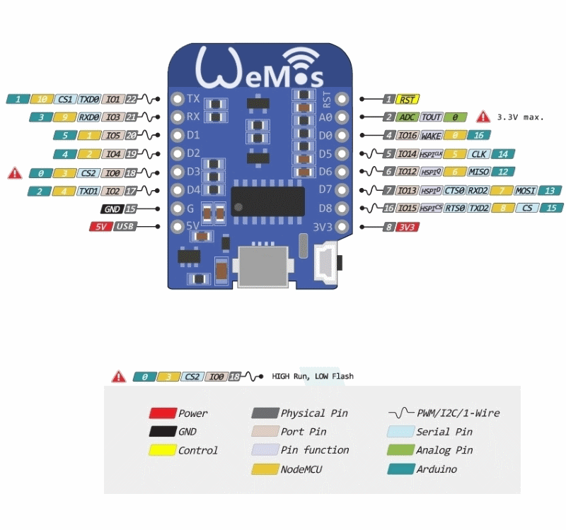

# Реле управляемые через mqtt

## Функциональность

### Датчики (вход)
Кнопка (Включить/Выключить освещение)
DHT22 / AM2302 (Датчик влажности и темпиратуры)

### Реле (выход)
* Реле 1 (Управление освещением, кнопкой или через mqtt)
* Реле 2 (Управление вытяжным вентилятором)
* Реле 3
* Реле 4
* Реле 5
* Реле 6
* Реле 7
* Реле 8

## MQTT
Сообщения с информацией от датчиков передаются на сервер mqtt через одинаковые интервалы времени.
Через очередь так же можно управлять реле.

Пример сообщения
```json
{"foo": "bar", "test": {"ff":0}}
```

## Подключение

...

## Распиновка d1 mini
